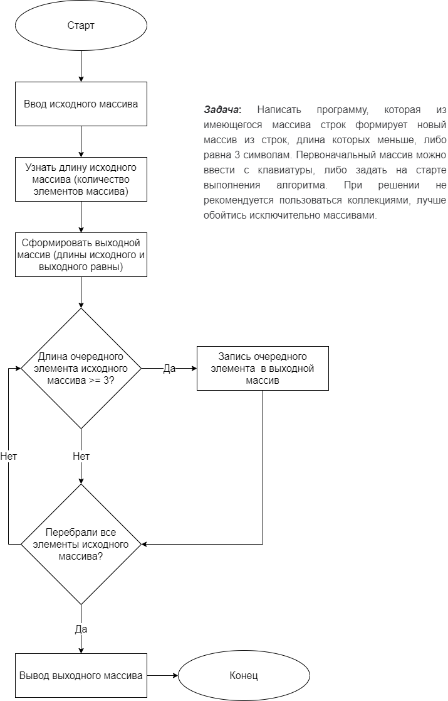
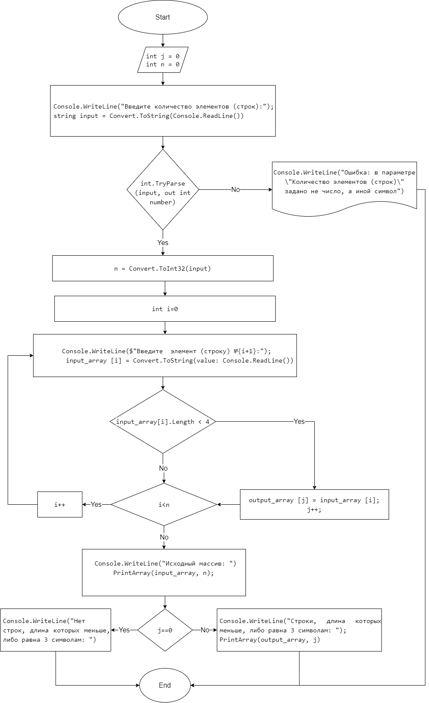
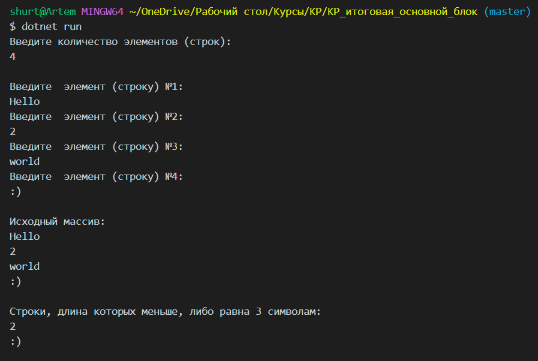
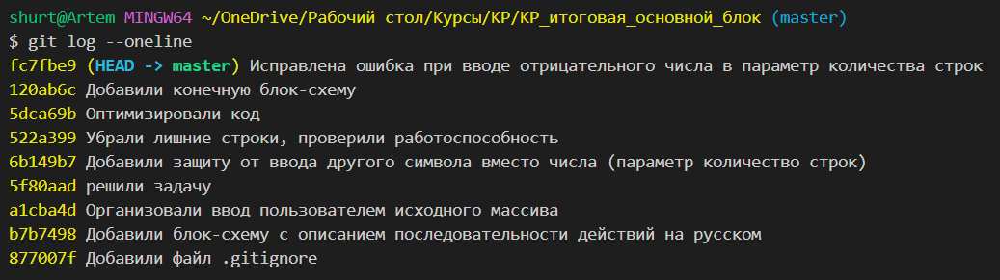

# Итоговая контрольная работа по основному блоку
## Задача
Написать программу, которая из имеющегося массива строк формирует новый массив из строк, длина которых меньше, либо равна 3 символам. Первоначальный массив можно ввести с клавиатуры, либо задать на старте выполнения алгоритма. При решении не рекомендуется пользоваться коллекциями, лучше обойтись исключительно массивами.

Примеры:

[“Hello”, “2”, “world”, “:-)”] → [“2”, “:-)”]

[“1234”, “1567”, “-2”, “computer science”] → [“-2”]

[“Russia”, “Denmark”, “Kazan”] → []

## Описание задачи
Задача алгоритмически не самая сложная, однако для полноценного выполнения проверочной работы необходимо:

1. Создать репозиторий на GitHub
2. Нарисовать блок-схему алгоритма (можно обойтись блок-схемой основной содержательной части, если вы выделяете её в отдельный метод)
3. Снабдить репозиторий оформленным текстовым описанием решения (файл README.md)
4. Написать программу, решающую поставленную задачу
5. Использовать контроль версий в работе над этим небольшим проектом (не должно быть так, что всё залито одним коммитом, как минимум этапы 2, 3, и 4 должны быть расположены в разных коммитах)

## Решение задачи
1. Перед написанием кода предварительно была составлена следущая блок-схема:

2. В ходе написания кода блок-схема была доработана. Была внедрена защита от ввода  иного символа вместо количества строк. Если нет строк, удовлетворяющих условию, выводится соответствующая информация.

3. Конечная блок схема с учетом доработок:

4. Описание решения: 
* Пользователь вводит количество строк, которые он хочет ввести
* Если количество строк введено правильно (не символ и больше 0), то формируется исходный и выходной массив
* Затем пользователь поочередно вводит строки. Если введеная строка удовлетворяет условиям, то она записывается в выходной массив.
* Вывод исходного и выходного массивов строк. Если нет строк удовлетворяющих условия, выводится соответствующее решение.

5. Пример работы задачи:

6. Лог:
